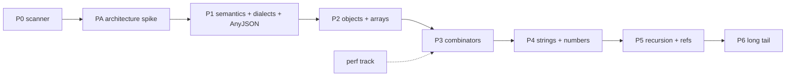

# ROADMAP.md - full JSON Schema coverage (spec-v1 profile)

Revision 2, 2026-09-20. Revision 1 is commit `f823416`. This revision
incorporates the findings of the 2026-09-20 requirements review and its
follow-up. This document and the ADRs under `docs/adr/` are the normative
requirements. Status: approved by the owner on 2026-09-20 as the
implementation specification for `spec-v1`; the PA decisions are adopted
(ADR-0005 completion reachability, ADR-0006 state model, ADR-0007 mask fast
path).

The owner approved full implementation on 2026-09-20; no phase is gated on
further approval. Historical gating record: before approval, only P0
(coverage scanner) and the architecture spike PA could start, because
neither commits contested semantics; implementation of `oneOf`, `allOf`
merging or the mask fast path waited on the PA decisions.

## 1. Goal, metrics and success criteria

Goal: compile real-world schemas exactly, not only the strict
`canonical-v1` profile. Corpus: the MaskBench snapshot of JSONSchemaBench
(11,306 files, revision `ba103c7`), plus the repository snapshot (9,558
files) for continuity.

Compile outcomes are separated (A8.1). Only the first bucket counts toward
exact coverage:

| Outcome bucket | Definition |
|---|---|
| compiled-exact | Compiled; semantics documented in semantics-spec-v1 |
| empty language | Satisfiability analysis proves the language is empty (A3); recognized, not compiled |
| invalid schema | `INVALID_SCHEMA` with a JSON pointer |
| unsupported | `UNSUPPORTED_FEATURE` with a JSON pointer; a refusal is never coverage |
| resource limit | `RESOURCE_LIMIT`; the limits are recorded in the report |

Every metric has its own gate:

| Metric | How measured | Baseline (2026-09-20) | Target |
|---|---|---|---|
| Exact coverage | coverage report (P0), deterministic counts | 624 / 11,306 first-blocker (exactness per file not yet proven) | >= 95%; the deviation list is literal (each entry: pointer + reason) |
| Determinism | same files, commit, profile, tokenizer, limits | n/a | counts match exactly (A8.2) |
| Functional correctness | pinned JSON Schema Test Suite + project semantic tests + A3 prefix checks | not running for spec-v1 | from P1 (A8.3); all supported combinations covered |
| Completed generation | every allowed token + EOS verified on finite corpora; cache on/off equality | partial (canonical-v1) | required for every new node kind (A3) |
| MaskBench gate | adapter with explicit profile selection, pinned slices | canonical-v1 only (the adapter has no profile switch) | spec-v1 run recorded per phase (A8.4, A8.5) |
| Performance | fixed baseline slice, phase slice and full set, measured separately | cold permissive state ~0.6 s; MaskBench TBM p90 609 ms | section 6 |
| canonical-v1 regression | v3 protocol thresholds 20% / 10% / 5% | GO | unchanged |

## 2. Principles (updated)

1. `canonical-v1` is frozen: semantics, tests, acceptance protocol and the
   documented support table stay as they are. All new behavior lives in
   `spec-v1` (name provisional; an ADR decides).
2. No silent weakening. A validation keyword is implemented exactly, or
   refused with `UnsupportedFeature` and a JSON pointer. Refusals are never
   counted as coverage (A1, A2).
3. No substitutes that change the allowed set. Replacing `oneOf` with
   `anyOf`, and `allOf` merging outside proven equivalence conditions, are
   prohibited in `spec-v1`. An approximate mode, if ever wanted, is a
   separate, explicitly enabled contract and stays outside the exact
   coverage metric (A1, A2).
4. Exactness accounts for type relations: `integer` is a subset of
   `number`; disjointness and exclusivity proofs use these relations (A1).
5. Tolerant reading is not tolerant semantics: dialect normalization
   preserves the original JSON pointers, including `definitions` (A7).
6. New composite nodes require the completion-reachability analysis before
   their masks exist (A3).
7. Acceptance separates compilation from session creation, completed
   generation and semantic tests; "compiles" is not "works" (A8.1).

## 3. Baseline (2026-09-20, MaskBench snapshot, 11,306 files)

First blocker per file, from the local scan (P0 brings the scanner into the
repo):

| Class | Files | Notes |
|---|---:|---|
| compiled | 624 | BFCL 586, Github_trivial 18, Github_easy 17, Github_medium 2, Glaiveai2K 1 |
| invalid_schema | 2,993 | missing `additionalProperties: false` 2,205; missing `required` 613; missing `type` 155; other 20 |
| unsupported_feature | 7,688 | `definitions` 2,329; draft-04 `$schema` 1,776; `id` 703; `allOf` 508; `anyOf` 440; `$id` 417; `self` 399; `oneOf` 133; draft-07 114; draft-06 88; the rest are smaller keyword groups |
| resource_limit | 1 | |

Notes: the counts are deterministic for a fixed corpus, commit, profile,
tokenizer and limits (A8.2); the histogram records the first blocker only
and is a prediction of what later phases will reveal, not evidence of full
support. The repository snapshot (9,558 files) and the MaskBench snapshot
(11,306 files) differ; coverage gates use the MaskBench snapshot, fetching is
documented in `benchmarks/maskbench/README.md`.

## 4. Correctness contracts (design inputs for PA)

### 4.1 Completion reachability (A3)

Current contract: `docs/semantics.md` section 10, ADR-0003; implementation:
`src/mask.zig:54` (`filtered = !tok.byte_complete and g.finite_literal`) and
`src/complete.zig`. The byte-complete fast path relies on a constructive
property of the current grammar: a live byte prefix can be completed. New
intersections do not inherit this property (the `{ab, xy}` intersect
`{ac, xy}` example: the prefix `"a` is live in every branch, yet there is no
common completion; even all 256 single-byte tokens do not remove the dead
end).

Requirements before P2/P3 mask work:

1. For every new node kind, a common-completion existence check (non-empty
   language of the product), with its termination conditions and the exact
   set of supported combinations.
2. Insufficient budget - an explicit error, never a partial mask. An
   undecided case is refused as `UnsupportedFeature`, an exhausted budget as
   `RESOURCE_LIMIT`; neither is classified as `empty language` - that bucket
   requires a proof of emptiness of the whole schema (section 1), and a dead
   prefix of a satisfiable schema is not such a proof.
3. Residual-satisfiability checks for `contains`, `dependentRequired`/
   `dependentSchemas`, `uniqueItems` and numeric constraints, not only for
   finished JSON.

Acceptance: finite small languages with exhaustive continuation
enumeration; verification of every allowed token and EOS; identical results
with and without the cache; byte-complete and supported incomplete
vocabularies.

### 4.2 State model, ownership and equality (A4, A6)

The current `State` is fixed arrays of frames and branches
(`src/parser.zig:14`); the key functions use the byte representation of
frames (`src/parser.zig:770`). Dynamic features (seen keys, seen values,
counters, later recursion) need a new contract. Design before the main P1:

1. AnyJSON: recursive production, `true`/`false` schema values, depth limit
   and behavior at the limit.
2. Representation of branches, the stack, and persistent/copyable sets;
   copying, ownership and equality rules for sessions and the cache.
3. Semantic keys with collision checking; data lifetimes; session, cache
   and total memory accounting; cancellation and freeing after errors.
4. Transport of processed-property/element information for future
   `unevaluated*`, so that P6 does not rework the IR again.
5. External registry: immutable snapshot/version participating in the
   artifact key together with profile and dialect.
6. Value equality for `const`/`enum`/`uniqueItems`: `1.0` is an integer,
   `[1, 1.0]` has a duplicate, objects with a different key order are equal,
   `true` differs from `1`. A hash only finds candidates; the decision is
   exact structural equality.

### 4.3 Mask fast path and parallelism (A5)

The allowed-next-byte set does not determine the full token mask (for
example, after the opening quote, `maxLength:1` and `maxLength:2` strings
accept the same next bytes, but the token `ab` is allowed only in the second
case; tokens can also close constructs and move to a parent). Therefore:

1. A provably safe fast path only for tokens whose every byte stays inside
   an equivalent state, with the equivalence conditions stated and tested;
   exact processing for all other tokens.
2. No raw byte-set as a universal cache key; shared cache entries account
   for the tokenizer/decoder identity and for the proven transition
   equivalence.
3. Differential tests against the plain trie walk, including long tokens,
   value boundaries, length limits and Unicode.
4. `max_threads_per_state` limits parse branches, not CPU threads
   (`src/parser.zig:56`, `docs/supported_features.md` section 6).
   Parallelism requires a separate workers limit and a shared memory/work
   budget; the meaning of the existing field must not change.

## 5. Phases

### Feature map (implementation and acceptance allocation)

| Feature | Phase | Acceptance anchor |
|---|---|---|
| Profile dispatch (`spec-v1` vs `canonical-v1`) | P1 | canonical-v1 tests and protocol unchanged |
| Tolerant reader, annotations, quick wins | P1 | keyword-class tests; refusals keep pointers |
| Dialect normalization and matrix (initial list draft-04 to 2020-12) | P1 | dialect x keyword tests; pointers preserved |
| Extended local `$ref` resolver (all local forms, scopes, `$anchor`) | P1 | resolver tests; cycles refused until P5 |
| AnyJSON, `true`/`false`, depth limit | PA design, P1 code | depth-limit behavior documented and tested |
| Open objects (dynamic key set) | P1 | key-set tests; residual satisfiability |
| Primitive type unions (`type: [...]`, absent type, nullable) | P1 | union acceptance tests |
| Structural `enum`/`const` of any JSON value | P1 | equality cases from 4.2 (`[1, 1.0]`, key order, `true` vs `1`) |
| `additionalProperties` as schema, `patternProperties` (regex gated), `propertyNames`, `min/maxProperties`, dependencies, tuple arrays, `contains` counters | P2 | per-keyword tests; 4.1 residual checks |
| `uniqueItems` | P2 | candidate hash plus exact equality |
| `anyOf` general union | P3 | live-branch and dead-product cases; cache on/off |
| `oneOf` exact exclusivity | P3 | the `number`/`integer` counterexample |
| `allOf` equivalence merge or exact intersection | P3 | closed-base counterexample; merge lemmas |
| `if`/`then`/`else`, limited `not` | P3 | lowering tests under 4.1 |
| `pattern` regex subset | P4 | ECMA-subset tests; unsupported constructs refused |
| Numeric ranges and `multipleOf` | P4 | decimal boundary tests without binary64-only |
| Recursion (pushdown or bounded) | P5 **done** (ADR-0008) | bounded unrolling, `REF_UNROLL_CAP=8` documented |
| External `$ref` registry | P5 **done** (ADR-0008) | immutable snapshot in the artifact key |
| `unevaluated*` | P6a **done** (ADR-0009) | scenario synthesis; oracle +154 PASS |
| `content*`, `$dynamicRef` | P6b **done** (ADR-0010) | content* as annotations, URI resolution, dynamic refs; oracle +103 PASS |
| Value-preserving serializer for the chosen byte language | P1 (if the policy restricts more than whitespace) | matches the documented language; used by MaskBench runs |
| Oracle harness (Test Suite + validator) | P0 scaffold, P1 tests | grows with every supported combination |
| MaskBench adapter profile switch | P0 scaffold, P1 active | profile recorded in results |

### P0 - Instrumentation and baselines (S, days; may start now)

1. `benchmarks/bench_jsb_coverage.py`: for every file record
   `{dataset, file, status, error_class, keyword, detail, source_pointer,
   error_stage}`; aggregate the outcome buckets of section 1, per-dataset
   counts, the keyword histogram and the positive/negative example counts;
   emit a JSON report plus a short markdown summary.
2. Report header: corpus revision and hash, engine commit, profile, limits,
   tokenizer, date; counts must be deterministic (A8.2).
3. Run against both snapshots; store the committed snapshot (for example
   `benchmarks/coverage/`); keep the last report committed, older ones
   optional.
4. Infrastructure (no engine behavior change): oracle harness scaffolding
   (pin the JSON Schema Test Suite and validator versions, wire the runner)
   and MaskBench adapter profile-selection scaffolding with recording (runs
   stay canonical-v1 until spec-v1 exists).
5. Acceptance: reproduces the section 3 baseline exactly (counts, not
   "within noise").

### PA - Architecture spike (M, 1-3 weeks; before the main P1)

Deliverables, per sections 4.1-4.3:

1. ADR: completion-reachability contract for product and union states, with
   the `{ab, xy}` example as a regression case.
2. ADR: AnyJSON, `true`/`false`, depth limits, state representation,
   ownership/equality, memory accounting (on paper plus a prototype on the
   current parser structures).
3. ADR: the mask fast path conditions and the differential test plan.
4. Re-estimated P1/P2 timelines based on the spike results; update the
   tracking table before starting the main P1.

### P1 - Semantics doc, dialects, tolerance, AnyJSON (M-L, weeks after PA)

Inputs (finished before coding):

1. Normative `docs/semantics-spec-v1.md` (A6): allowed values and their
   equality; serialization policy (whitespace, escapes, key order, numeric
   forms) as an explicit decision with its consequences. `--compact` is not
   a canonicalizer: it removes whitespace only and keeps the key order and
   the `1.0` spelling (verified examples: `{b: 2, a: 1}` stays in that
   order; `1.0` stays `1.0`). After the byte language is chosen, either a
   value-preserving serializer for that language is required, or a
   demonstrated match between the ordinary compact serializer and the
   chosen language. Serialization/profile incompatibilities are recorded
   separately from assertion errors, normalization must not repair invalid
   values, and cross-engine timing uses identical resulting token streams.
   Accepting arbitrary JSON texts instead widens the states and the cold
   path. The decision is recorded.
2. Dialect x keyword matrix (A7): values, scope, applicability by type,
   error forms, key absence; `$ref` siblings per draft (ignored in draft-07,
   applied in 2020-12), resource addressing, `items`/`additionalItems`/
   `prefixItems`, old exclusive bounds, dependencies; dialect without
   `$schema`; unknown `$schema`; cross-draft keywords; vocabulary
   requirements (a required unsupported vocabulary is a refusal, section
   8.1.2); `format` as annotation versus the Format-Assertion vocabulary;
   original JSON pointers preserved during normalization. Initial supported
   dialect list: draft-04, draft-06, draft-07, 2019-09, 2020-12; a schema
   without `$schema` uses the documented default (2020-12); custom
   metaschemas are rejected.

Implementation:

1. Profile dispatch in `src/c_api.zig` (`spec-v1`; `canonical-v1` behavior
   preserved bit for bit).
2. Keyword classes in `src/schema.zig`: implemented assertions; annotations
   (extend `isAnnotation`); unknown/extensions ignored in `spec-v1`, errors
   in `canonical-v1`; known-but-unimplemented assertions refused with a
   pointer.
3. AnyJSON and `true`/`false` values per the PA designs; open objects
   (`additionalProperties` absent or `true`) with the dynamic key set;
   `additionalProperties` as a schema is explicitly P2, resolving the
   revision-1 duplication.
4. Extended local `$ref` resolver: `#`, `#/$defs/...`, `#/definitions/...`
   and arbitrary JSON pointers through one implementation; `id`/`$id` scope
   stack; `$anchor`; original JSON pointers preserved (A7). Cycles remain
   refused with a precise error until P5.
5. Type model: primitive unions implemented here - `type: [...]`, nullable
   forms, and the absent `type` as a union over the supported primitive
   types (the general `anyOf` union of arbitrary subschemas is P3);
   structural `enum`/`const` of any JSON value (objects, arrays) with the
   equality rules of 4.2: candidate hashing plus exact equality under the
   serialization policy of semantics-spec-v1.
6. Quick wins: absent `required`, absent `properties`, annotation keywords.
7. Independent oracle (A8.3): the harness (pinned JSON Schema Test Suite and
   validator versions) is prepared in P0 as infrastructure; from P1 the
   semantic tests grow with every supported combination; decimal boundaries
   never checked with plain binary64 arithmetic alone; engine parity stays
   diagnostics, not proof.
8. MaskBench adapter: profile selection and its recording in results
   (`benchmarks/maskbench/blg_engine.py`); the flag scaffolding is P0
   infrastructure, the switch becomes active with the spec-v1 profile. When
   the serialization policy restricts more than whitespace, a
   value-preserving serializer implementing the policy - `--compact` only
   drops spaces, it does not reorder keys or normalize numeric spellings.

Acceptance: outcome buckets separated and deterministic; all baseline tests
plus new phase tests pass (120/120 and 403/403 stay the historical base, not
a perpetual requirement); the MaskBench gate runs with the explicit profile
on pinned slices; the deviation list contains only documented limits (depth,
stack, budget), never weakened semantics.

### P2 - Objects and arrays (M, weeks)

1. `additionalProperties` as a schema (value language per extra key);
   `patternProperties` (parsed here, regex from P4); `propertyNames`;
   `minProperties`/`maxProperties`.
2. `dependentRequired`, `dependentSchemas`, draft-07 `dependencies`.
3. Arrays: `prefixItems`, tuple `items`, `additionalItems`; `contains` with
   `minContains`/`maxContains` (session counters, residual satisfiability
   per 4.1).
4. `uniqueItems` via candidate hash plus exact structural equality (4.2);
   equality cases from semantics-spec-v1.
5. Acceptance: coverage target 30-45% (prediction, refine after P0/PA);
   per-keyword semantic tests including the equality cases.

### P3 - Combinators (L, 1-2 months)

Prerequisite: the 4.1 completion contract is implemented; no new mask code
before it exists.

1. `oneOf`: exact exclusivity only. Disjointness analysis is subtype-aware
   (`integer` subset of `number`). If exclusivity for a case is not
   decidable, refuse with `UnsupportedFeature` and a pointer. No `anyOf`
   substitution, no deviation-list entry (A1). Acceptance: counterexample
   `{"oneOf":[{"type":"number"},{"type":"integer"}]}` - `1` forbidden, `1.5`
   allowed; plus finite-language exhaustive checks.
2. `anyOf`: explicit implementation of the general union of arbitrary
   subschemas (the primitive type unions of P1 item 5 are a subset), built
   with the 4.1 completion analysis; acceptance includes live-branch and
   dead-product cases plus the cache on/off equality.
3. `allOf`: merging is an optimization only, under equivalence conditions
   stated as lemmas and approved before coding; scopes are preserved and the
   constraints of the same property are intersected; when no safe merge
   exists, the exact intersection or a refusal. Acceptance includes the
   closed-base counterexample (an `allOf` object branch's
   `additionalProperties: false` scopes to the keys declared in that same
   branch; regression tests in `tests/test_spec_v1_review_counterexamples.py`).
4. `if`/`then`/`else` lowering; `not` limited to forms whose complement the
   completion analysis supports (`{const}`, `{enum}`, `{type}`,
   `{required}`, key-presence exclusions).
5. Property order of merged and open objects is fixed in
   semantics-spec-v1 before coding.
6. Acceptance: target 45-60% (prediction); parity spot-checks vs llguidance
   as diagnostics only.

### P4 - Strings and numbers (L, 3-6 weeks)

1. `pattern`: own ECMA-262 subset compiler to DFA (classes, quantifiers,
   alternation, anchors, escapes); product with length bounds; intermediate
   transitions cover UTF-8, escapes and counters (A5); unsupported constructs
   fail with a precise pointer. Unblocks `patternProperties` (P2).
2. `format` stays an annotation (standard 2020-12); the Format-Assertion
   vocabulary is handled per the matrix (A7).
3. Numbers: `minimum`/`maximum`/`exclusive*` with exact decimal boundary
   arithmetic; `multipleOf` exact for integers, and for decimals either
   exact support or an explicit refusal (A6); oracle checks of boundaries
   without binary64-only arithmetic (A8.3).
4. Acceptance: target 55-70% (prediction); property-based tests against the
   pinned oracle; differential mask tests per 4.3.

### P5 - Recursion and references (XL, decision-gated)

1. Own spike and ADR: pushdown states versus bounded unrolling with a
   documented depth limit; the PA state model must already allow either.
2. Recursive local `$ref` (trees, linked lists; Kubernetes and Github
   schemas).
3. External `$ref` via the immutable registry snapshot of 4.2, participating
   in the artifact key.
4. Acceptance: target 70-85% (prediction); limits documented as explicit
   deviations.

### P6 - Long tail (XL, ongoing)

**P6a done (2026-09-21, ADR-0009)**: `unevaluatedProperties`/
`unevaluatedItems` by compile-time scenario synthesis; budget-guard
refusals carry a pointer. **P6b done (2026-09-22, ADR-0010)**:
`contentEncoding`/`contentMediaType`/`contentSchema` are annotations
(2020-12 Validation section 8); RFC 3986 relative-URI resolution with an
in-document `$id` resource index; `$dynamicRef`/`$dynamicAnchor`
(2020-12) and `$recursiveRef`/`$recursiveAnchor` (2019-09) over the
compile-time dynamic scope; the 2019-09/2020-12 reference-sibling
conjunction. Oracle spec-v1: 1015 -> 1118 PASS, 0 MISMATCH,
0 ENGINE_ERROR; canonical-v1 bit-for-bit frozen.
Acceptance: every remaining refusal carries a documented reason and pointer;
target 85-95%+ (prediction).

## 6. Performance track (parallel, 3-6 weeks)

Measured problem: a first visit of a permissive state (string content) costs
about 0.6 s at a 128k-token vocabulary; a cache hit is 1.3 us. The mask DFS
in `src/mask.zig` feeds bytes to `parser.feedBytes` per trie node (roughly
1.5 us per node, about 400k nodes for the Llama vocabulary). MaskBench
framing: TBM p90 609 ms against 133 us for llguidance under a protocol where
most masks are first visits.

Corrected approach (A5):

1. Provably safe fast path only for tokens whose every byte stays inside a
   provably equivalent state; the equivalence conditions are stated,
   tested, and differential-checked against the plain walk.
2. Exact path improvements: fewer state copies per node, transition tables
   keyed by (state, byte), bit tricks for token chains.
3. No raw byte-set as a universal key; shared caches account for the
   tokenizer/decoder identity and proven equivalence (4.3).
4. CPU parallelism, if pursued, gets its own workers limit and a shared
   memory/work budget; `max_threads_per_state` stays parse-branch
   accounting (A5).

Measurements use separate distributions (A8.5): a fixed baseline slice, the
new phase slice and the full available set, each with fixed mode, warmup,
parallelism, observation count and aggregation; engine comparisons on the
intersection of identical schemas/instances/tokens. Targets: cold permissive
state <= 50 ms on the fixed slice (stretch <= 10 ms); MaskBench TBM p90
<= 1 ms under the pinned protocol and profile; warm path not worse than the
1.3 us baseline. The two targets measure different distributions and are
reported separately.

## 7. Risks and decision points

| Risk | Mitigation |
|---|---|
| PA outcomes change the P1/P2 estimates | Re-estimate after the spike; the tracking table is updated before the main P1 starts |
| Completion analysis cannot decide a case, or its budget is exhausted | The case is refused (`UnsupportedFeature`; `RESOURCE_LIMIT` for budget) with a pointer and never classified as `empty language`; that bucket requires a proof of emptiness of the whole schema, not a dead prefix of a satisfiable one (A8.1, section 1) |
| Removal of weakened `oneOf`/`allOf` lowers the achievable coverage | Accepted: exactness over predicted numbers; refusals stay precise |
| Recursion needs a core redesign | P5 spike; bounded unrolling fallback with a documented limit |
| Perf fast path silently changes masks | Differential tests are mandatory (4.3); cache keys carry proven equivalence |
| Corpus drift | Pin `ba103c7`; refresh only with a new baseline snapshot in the same commit |

## 8. Sequencing

1. Approve this revision: exact semantics, limits and metrics. **Done
   2026-09-20**: approved by the owner, full implementation authorized; the
   PA decisions are adopted (ADR-0005/0006/0007).
2. Perform P0, including the oracle harness and the adapter
   profile-selection scaffolding (P0 infrastructure, section 5). **Done**
   (section 9). Historical gating: engine behavior changes were to start
   only after PA and the normative semantics were approved; that approval
   is now granted.
3. Run the PA spike (A3-A5: AnyJSON, states, reachability, safe fast path);
   re-estimate P1/P2 from its results. **Done** (section 9); the ADRs are
   under `docs/adr/`.
4. Implement dialects and the staged expansion per the corrected DAG;
   keep canonical-v1 and the v3 protocol as a separate regression gate.
   P1-P6 implemented (2026-09-21/22, section 9): oracle spec-v1 at
   1118 PASS / 0 MISMATCH / 0 ENGINE_ERROR, canonical-v1 frozen
   (95 PASS, bit-for-bit). **Acceptance reopened (2026-09-22)**:
   a 2026-09-22 audit found four correctness
   blockers (R1 dead-end tokens, R2 enum/const losing adjacent
   constraints, R3 combinator branch value semantics, R4 MaskBench
   serializer mutating string values) and open acceptance items R5-R7.
   The fixes and regressions are pinned in
   `tests/test_spec_v1_r1_residual.py`, `tests/test_spec_v1_r2_r3.py`,
   `tests/test_audit_regressions.py` and
   `tests/test_maskbench_serializer_hook.py`.
   The rows below stay as implementation history; P1-P6 are not accepted
   until R1-R4 are fixed and R5-R7 are re-measured (both done - see the
   two resolution paragraphs below; the acceptance is closed as of
   2026-09-28).

   **Acceptance resolution (2026-09-27)**: R1-R4 fixed and re-verified
   (the audit regression suite 34/34 clean (now maintained as
   `tests/test_audit_regressions.py`), `zig build test` green, pytest 1003
   passed / 25 skipped, oracle 6/6 runs bit-for-bit stable across the
   fix builds; R4 full-corpus MaskBench serializer re-measure: 624
   passing, 0 validation/invalidation errors, 0 serialization
   incompatibilities - `benchmarks/maskbench/README.md`). Two additional
   defects found by the re-measurement itself were fixed: a mask
   normal-form bug pruning continuations after `minLength`-bounded
   strings, and an engine crash on long runs (`page_allocator` per-
   allocation mmap drove the process to `vm.max_map_count`; a `munmap`
   splitting a merged VMA then failed ENOMEM and panicked on the
   `unreachable` branch in `std.posix.munmap` - root allocator switched
   to `smp_allocator`, caught via GDB on `debug.defaultPanic`).
   R6 closed: oracle re-run on all five dialects (draft4/6/7, 2019-09,
   2020-12 spec-v1 + canonical-v1) with results in
   `tests/oracle/results/oracle-fix1-*.json`; the two whitelisted
   ref.json sibling-`id` MISMATCHes remain a documented deviation
   (`docs/supported_features.md`). R7 closed on the final build
   (`benchmarks/reports/20260927T203000_adr0007_fix2/REPORT.md`, pinned
   snapshot). R5 exact coverage: see the Corpus coverage row (split
   metrics re-measured on the final build).

   **Post-acceptance memory fix (2026-09-28, build "fix2")**: the full
   R5 coverage re-run exposed a real TEMP-category leak (+4,466 bytes
   per compile/session/fill_mask cycle, growing without bound):
   `memoPut` in `src/complete.zig` duplicated the key before
   `map.put`, and on an existing key `put` kept the old key while the
   new copy was lost. Fixed via `getOrPut` (update in place, dupe only
   on insert). Confirmed flat on the TEMP repro (968 bytes per cycle
   including `reset_cache()`) and at 0 live bytes after `deinit()`
   under `DebugAllocator`. All gates re-run on fix2: the audit
   regression suite 34/34,
   `zig build test` green, pytest 1003 passed / 25 skipped (plus 123
   passed / 25 skipped C-extension tests under `LD_LIBRARY_PATH`),
   oracle 6/6 rows+summary bit-for-bit identical to fix1, ADR-0007
   re-accepted (see the Perf row). Full-corpus R5 coverage completed
   on fix2 (repo + MaskBench, semantic checks, resumable chunked
   driver with atomic chunk publication and a duplicate-detecting
   merge): see the Corpus coverage row.

Historical gating record (kept, no longer in force): before the owner
approval only P0 and profiling could start; `spec-v1` implementation of
`oneOf`, `allOf` and the mask fast path waited on the PA decisions.

## 9. Tracking

| Phase | Status | Coverage after (exact) | Notes |
|---|---|---|---|
| P0 | done (2026-09-20) | 5.5% (first-blocker baseline) | scanner reproduces the section-3 baseline exactly; reports committed at `benchmarks/coverage/`; oracle harness at `tests/oracle/` (pinned Test Suite 23.2.0 `95fe6ca` + jsonschema 4.26.0); adapter profile scaffold live (`BOLORGIR_PROFILE`, `benchmarks/maskbench/blg_engine.py`); exactness per file proven only for the 624 compiled via the MaskBench semantics check (0 validation/invalidation errors) |
| PA | done (2026-09-20) | n/a | ADR-0005 completion-reachability, ADR-0006 state model, ADR-0007 mask fast path; all adopted by the owner |
| P1 | done (2026-09-21) | oracle spec-v1 95 → 411 PASS | profile dispatch, keyword classes, AnyJSON/`true`/`false` (ADR-0006), open objects with COW dynamic key set, primitive type unions, structural `enum`/`const`, extended local `$ref` resolver, dialect normalization (draft-04..2020-12); run `tests/oracle/results/oracle-20260921T033621Z.json`; corpus exact-coverage % re-measured after P6b (see the Corpus coverage row) |
| P2 | done (2026-09-21) | oracle spec-v1 411 → 631 PASS, 0 MISMATCH | `additionalProperties` as schema, `patternProperties` (one literal-substring pattern), `propertyNames`, `minProperties`/`maxProperties`, `dependencies`/`dependentRequired`/`dependentSchemas`, `prefixItems`/tuple `items`/`additionalItems`, `contains` + `minContains`/`maxContains`, `uniqueItems`; dialect matrix updated |
| P3 | done (2026-09-21) | oracle spec-v1 631 → 726 PASS, 0 MISMATCH | `anyOf` general union, `oneOf` exact exclusivity (subtype-aware disjointness), `allOf` exact intersection (comb node), `if`/`then`/`else` lowering, `not` over the supported complement forms; run `tests/oracle/results/oracle-20260921T091455Z.json` |
| P4 | done (2026-09-21) | oracle spec-v1 726 → 751 (pattern) → 833 (numbers) PASS, 0 MISMATCH | `pattern` as an ECMA-262-subset DFA (unblocks regex `patternProperties`, one pattern); `minimum`/`maximum`/`exclusive*`/`multipleOf` in exact decimal arithmetic; runs `tests/oracle/results/oracle-20260921T095040Z.json`, `oracle-20260921T122752Z.json` |
| P5 | done (2026-09-22) | oracle spec-v1 833 → 861 PASS, 0 MISMATCH | ADR-0008: recursive local `$ref` by bounded unrolling (`REF_UNROLL_CAP=8`, mask-visible bottom), external `$ref` via the immutable registry snapshot; runs `tests/oracle/results/oracle-p5-final-spec-v1.json` (spec-v1), `oracle-p5-final-canonical-v1.json` (95 PASS, frozen); perf re-check `benchmarks/results/p5_adr0007.json` (differential gate PASS, no regression) |
| P6 | done (P6a 2026-09-21, P6b 2026-09-22) | oracle spec-v1 861 → 1015 (P6a) → **1118 PASS / 99 SKIPPED / 1 KNOWN_GAP / 0 MISMATCH / 0 ENGINE_ERROR** | P6a `unevaluatedProperties`/`unevaluatedItems` (2019-09/2020-12) by compile-time scenario synthesis (ADR-0009), budget-guard refusals with pointer; run `tests/oracle/results/oracle-p6a-spec.json`. P6b content* as annotations, RFC 3986 relative-URI resolution with an in-document `$id` resource index, `$dynamicRef`/`$recursiveRef`, 2019-09/2020-12 reference siblings (ADR-0010); run `tests/oracle/results/oracle-p6b-spec.json`. The remaining 99 SKIPPED are all documented refusals with a JSON pointer (`docs/supported_features.md` §1a); canonical-v1 frozen (95 PASS / 7 KNOWN_GAP, `oracle-p6b-canonical.json`) |
| Corpus coverage | **exact coverage accepted (2026-09-28, semantic-coverage requirement closed)** on the fix2 build | spec-v1 split metrics (each metric its own base; compile share alone is not exact coverage). Repo snapshot 9,558 files: compile 9,251 (96.79%), explicit refusals 307 (3.21%: invalid 6 / unsupported 151 / resource_limit 143 / unsatisfiable 7), session success 9,240/9,251 (99.88%), generation success 8,901/9,251 (96.22%; 96.34% of attempted), generated-doc validity vs jsonschema 8,874/8,901 (99.70%). MaskBench snapshot 11,306 files: compile 10,790 (95.44%), explicit refusals 516 (4.56%: invalid 4 / unsupported 359 / resource_limit 145 / unsatisfiable 8), session success 10,776/10,790 (99.87%), generation success 10,396/10,790 (96.35%; 96.49% of attempted), generated-doc validity 10,369/10,396 (99.74%), valid-instance acceptance 12,759/13,604 (93.79%), invalid-instance rejection 21,041/22,294 (94.38%), serialization incompatibility 0/35,898 (0.00%). The only 2 invalid instances accepted by engine+serializer against jsonschema are the documented draft-04 integer divergence (12345.0 as `integer`; `docs/supported_features.md` §9) | fix2 release build (`zig build --release=fast`, effectively ReleaseSafe; lib sha256 `bc25a03a...`, combined src/include/build.zig sha256 `33cfeb8f...` via `{ find src include -type f; echo build.zig; } \| LC_ALL=C sort \| xargs sha256sum \| sha256sum`); profile via `BOLORGIR_COVERAGE_PROFILE=spec-v1` (`benchmarks/bench_jsb_coverage.py`, chunked resumable driver, atomic chunk publication, merge with duplicate detection); merged reports `benchmarks/coverage/spec-v1/coverage_{repo,maskbench}.{json,md}` (byte-context destroy failures: 0); canonical-v1 re-run unchanged (38 / 9,558 and 624 / 11,306; identical corpus hashes) |
| Perf | ADR-0007 accepted on the fix2 tree (2026-09-27; re-accepted after the memoPut memory fix) | n/a | fixed slice `benchmarks/baseline_slice.json`; final acceptance `benchmarks/reports/20260927T203000_adr0007_fix2/REPORT.md` (pinned snapshot: HEAD `c1cc2cb` + dirty tree, combined src/include/build.zig sha256 `33cfeb8f...` via `{ find src include -type f; echo build.zig; } \| LC_ALL=C sort \| xargs sha256sum \| sha256sum`, lib sha256 `bc25a03a...`): cold permissive p50 388.8 ms → **4.40 ms** (~88x, GO vs <= 50 ms, stretch <= 10 ms met); MaskBench TBM p90 over the full pinned slice (**24 compiling files / 564 masks** of the 129 BFCL_java candidates, honestly scoped - not the old 20-file canonical slice) → **274.3 us** (the <= 1 ms target MET); warm cache-hit C-ext p50 **0.898/0.946 us** (the <= 1.3 us guard MET; the round-2 1.90 us figure is superseded - different build, same methodology); differential gate PASS (4 probe + 425 maskbench states); previous acceptance `benchmarks/reports/20260927T115548_adr0007_fix1/REPORT.md` (same tree minus the memoPut fix, superseded); kill switches `BLG_MASK_FAST_PATH=0`, config `mask_fast_path`, `max_workers`. Re-measured on the fix3-final build (2026-09-30, `benchmarks/reports/20260930T030906_fix3final_adr0007/`, lib sha256 `bac52820...`): differential gate PASS (4 probe + 425 maskbench states); cold permissive p50 4.40 -> 8.73 ms (GO <= 50 ms and stretch <= 10 ms still met); MaskBench TBM p90 274.3 -> 357.7 us over the same 24-file / 564-mask slice (<= 1 ms met); warm-ext p50 0.898/0.946 -> 1.206/1.297 us on a quiet re-run (<= 1.3 us guard met with a 3 ns margin on that specific measurement; the first fix3-final run measured 1.313/1.394 under load). The ~30-100% warm/cold delta vs fix2 is consistent with the strict-D3 certification cost but not proven to be it - a warm cache hit returns before certification runs |
| fix3 | done (2026-09-30; strict ADR-0005 D3 + closed-form certificate families, accepted with a documented strict-D3 residual) | oracle spec-v1 ENGINE_ERROR 338 -> **196** (draft4 27, draft6 35, draft7 37, 2019-09 48, 2020-12 49; residual pinned as an exact-row ratchet - `tests/oracle/engine_error_residual_spec_v1.json` identifies every row by (draft, suite_file, case, test_index) plus the engine code, which must be exactly `error:RESOURCE_LIMIT`; enforced live for draft2020-12 by `tests/oracle/test_oracle_spec_v1.py::test_spec_v1_no_engine_errors` and for all five drafts by `tests/oracle/test_oracle_dialects.py::test_engine_error_residual_pinned`); MISMATCH/SKIPPED/canonical-v1 identical to fix2 (95 PASS); 26-case MaskBench recheck 14 ok / 12 RESOURCE_LIMIT (fix2: 25/26); 126-instance recheck of the 74 previously rejecting files: 75 accept / 50 RESOURCE_LIMIT / 1 reject (traced to the serializer key merge across a oneOf-$ref branch, not the engine - the correctly ordered serialization is accepted) | strict D3 (a): a budget-exhausted reachability proof is UNKNOWN, not alive - mask/accept fail with RESOURCE_LIMIT instead of admitting an unproven token (`src/mask.zig`, `src/complete.zig`, `src/c_api.zig`); (b) oneOf impossibility certificates via *equality* of residual behaviors (`dfaResidualEquiv`/`trieSubEquiv`/`numExpLockstep` vote-links; the pairwise-distinct-residuals case `{a,b},{a,c},{b,c}` is a documented boundary); eight closed-form certificate families in step 3 (`certOpenObjCounted`, `repeatContainsDoom`, contains synth, dependentSchemas virtual facets, `openObjDepValueDoom`, `emitNumMult`, `emitPatSuffixMerged` same-allOf-instance only, `numExpLockstep`). Three separate metrics: **no false R1 admissions detected in the enumerated checks** (acceptance repro `tests/test_spec_v1_r1_residual.py` 24/24 in lazy/adaptive x fast-path on/off; these checks do not prove the absence of every false admission or rejection across the whole profile); RESOURCE_LIMIT residual = 196 oracle rows + 12/26 + 50/126 (10 documented limitation families with counterexample schemas in the report); perf in the Perf row. The strict-D3 boundary is the *cost of proof* for the bounded ADR-0008 grammar (REF_UNROLL_CAP=8), not undecidability; for recursive-tail truncation inside `oneOf`/`not`/`if` the guarantee is R1 w.r.t. the truncated grammar, not equivalence to the untruncated schema (non-monotonicity caveat, ADR-0008 Decision 2). Full report `benchmarks/reports/20260929T_fix3_adr0007/REPORT.md`; final build identified by lib sha256 `11352e82...` (rebuild: `zig build -Drelease=true -Dcpu=baseline` on the pinned sources; zig 274/274 - three leftover debug tests, one reading a hardcoded /tmp schema path, and the unused `synth.debugCandidates` helper removed, so the zig gate no longer depends on /tmp; audit 34/34, pytest 1025 passed / 0 failed); sources uncommitted by policy |

Update rules: after each phase, refresh this table, the support table
(`docs/supported_features.md`, section 8) and the literal deviation list;
a phase is closed only when every refusal reason is written down with a
sample JSON pointer and the phase's semantic tests pass.

## 10. References

- `tests/test_spec_v1_review_counterexamples.py` - the counterexamples
  of the retired 2026-09-20 review documents as maintained regression
  tests.
- `docs/semantics.md`, `docs/supported_features.md`, `docs/adr/ADR-0003`.
- JSON Schema: oneOf (core section 10.2.1.3), instance equality (core section
  4.2.2), integer type (validation section 6.1.1), vocabularies (core
  section 8.1.2), Format-Assertion (validation section 7.2.2), extending
  closed schemas (understanding-json-schema, object reference).

Revision history: revision 1 `f823416` (initial plan); revision 2 (this
document) adopts the 2026-09-20 findings: exact `oneOf`, equivalence-only `allOf`
merging, the completion-reachability contract, AnyJSON and the state model
before the main P1, the corrected fast-path premise, the semantics document
and dialect matrix as P1 inputs, separated acceptance metrics, pinned perf
slices, the PA spike phase and provisional timelines. Final wording pass
(2026-09-20): explicit phase allocation restored for `anyOf`, `type: [...]`,
structural `enum`/`const` and the extended local resolver; the serialization
serializer separated from `--compact`; the risk classification aligned with
the outcome buckets of section 1. Follow-up findings applied: the
feature map table and the initial dialect list restored, the serializer
contract spelled out, the bucket mapping fixed in the risk table, the
normative content consolidated into this document and the ADRs, and the
oracle/adapter scaffolding assigned to P0 infrastructure.
